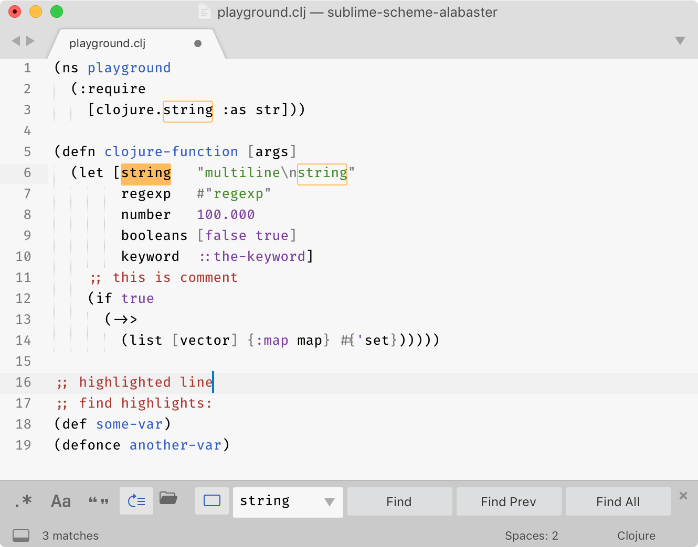
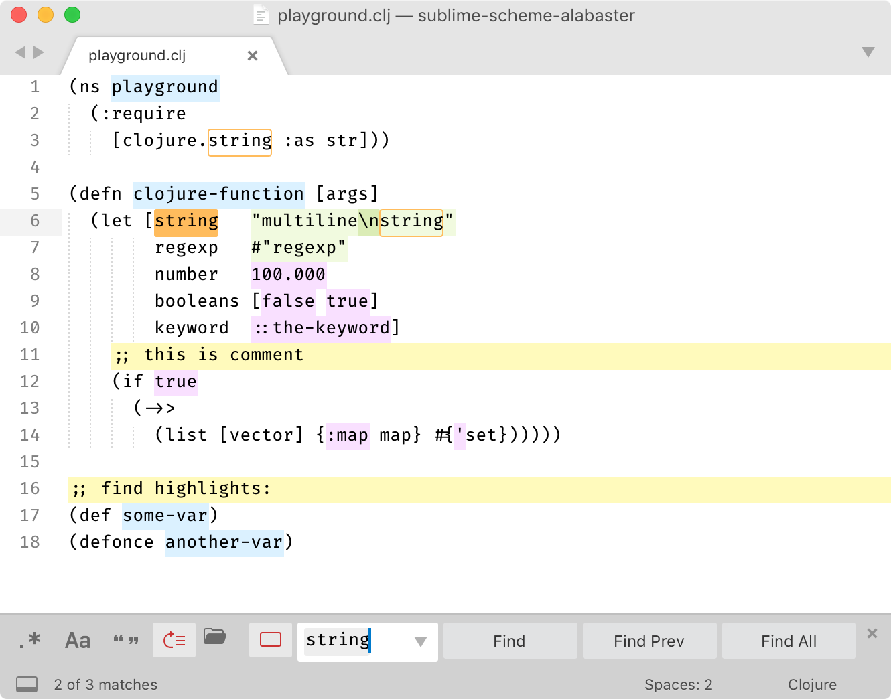

# Alabaster Color Scheme

A light color scheme with minimal amount of highlighting for Sublime Text 3.

## Motivation

Most color schemes highlight everything they can, ending up looking like a fireworks show.

Instead, Alabaster uses minimal highlighting; it defines just four classes:

  1. Strings
  2. All statically known constants (numbers, symbols, keywords, boolean values)
  3. Comments
  4. Global definitions

Additionally:

- Alabaster does not highlight standard language keywords (if, else, function, etc). They are usually least important and most obvious part of any program.

- Alabaster highlights comments. Most schemes try to dim comments by using low-contrast greys. I think if code was complex enough that it deserved an explanation then it’s that explanation we should see and read first. It would be a crime to hide it.

- Alabaster doesn’t use font variations. It’s hard to scan code when it jumps between normal, **bold** and *italics* all the time. Also, not all fonts provide bold/italics variants.

- Having minimal amount of rules means you can consciously use them to look for the exact piece of information you need. Most other “fireworks” schemes provide only one meaningful contribution: if it’s colored it’s probably syntactically correct. Instead, in Alabaster you can actually remember all the rules, and e.g. if you need to look for a string you know that you’re looking for a green token. And all the strings really pop out because there are not many other things highlighted.

- Alabaster only highlights things that parser could identify reliably. I believe that if highlighting works only partially then it does more harm than good. When highlighting works reliably, your brain learns to rely on it. When it’s not reliable, your brain spends precious brain cycles to re-check everything it sees on the screen.

## Screenshots

## Alabaster BG

Alabaster BG is a variation of the same scheme but it uses background color for highlighting instead of text color. The idea is that it is easier to read when all text is black rather than when it changes color every few words. The colored background in that case creates a separate layer which is easier to ignore if you just trying to read the words.

 

## Installation

Both schemes are packed in the same package.

### via Package Control

[Coming...](https://github.com/wbond/package_control_channel/pull/7402)

### Manual Installation

1. Download `*.sublime-color-scheme` files from this repo.
2. Select `Preferences → Browse packages` from the main menu.
3. Copy `*.sublime-color-scheme` files to `Packages/User/`.
4. Select `Preferences → Color Scheme ...` and pick `Alabaster` or `Alabaster BG` from the menu.

## License

[MIT License](./LICENSE.txt)

## Variations

- Version for Visual Studio Code [tonsky/vscode-theme-alabaster](https://github.com/tonsky/vscode-theme-alabaster)
- Version for Vim [agudulin/vim-colors-alabaster](https://github.com/agudulin/vim-colors-alabaster)
- Alternative version for Sublime Text 2 [freetonik/Travertine](https://github.com/freetonik/Travertine)
- Dark version for VS Code [apust/vscode-rubber-theme](https://github.com/apust/vscode-rubber-theme)
- Original version for LigthTable [tonsky/alabaster-lighttable-skin](https://github.com/tonsky/alabaster-lighttable-skin)
